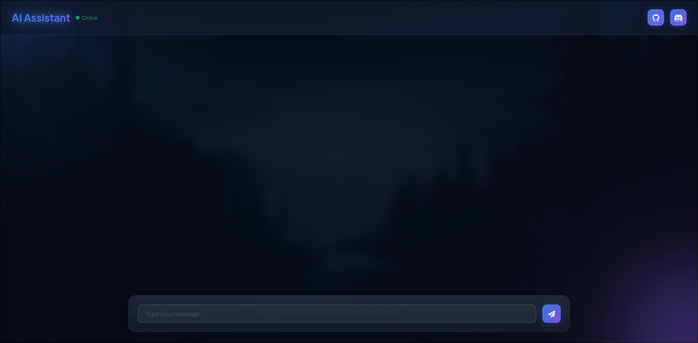

# AI Chat Interface

A modern, real-time chat interface powered by Google's Gemini AI model, built with Flask and JavaScript. This application provides an elegant way to interact with AI, featuring code syntax highlighting, markdown support, and image analysis capabilities.



## 🌟 Features

- Real-time chat interface with elegant animations
- Code syntax highlighting with copy functionality
- Markdown support for formatted messages
- Image analysis using Gemini Pro Vision
- Modern UI with glass-morphism design
- Responsive layout for all devices
- Real-time typing indicators
- Smooth animations and transitions

## 🚀 Tech Stack

- **Backend**: Flask (Python)
- **Frontend**: Vanilla JavaScript
- **AI Model**: Google Gemini Pro & Gemini Pro Vision
- **Styling**: Custom CSS with modern design principles
- **Syntax Highlighting**: Prism.js
- **Icons**: Font Awesome
- **Fonts**: Plus Jakarta Sans, Fira Code, Inter

## 📋 Prerequisites

- Python 3.7+
- Google API Key for Gemini AI
- Modern web browser
- pip (Python package manager)

## 💻 Installation

### Using Docker
```bash
# Clone the repository
git clone https://github.com/ma1sk/ai-chat-interface.git
cd ai-chat-interface

# Copy environment file and add your API key
cp .env.example .env
# Edit .env with your API key

# Build and run with Docker
docker-compose up --build
```

### Manual Installation
```bash
# Clone and setup
git clone https://github.com/ma1sk/ai-chat-interface.git
cd ai-chat-interface
python -m venv venv
source venv/bin/activate  # or `venv\Scripts\activate` on Windows

# Install dependencies
pip install -r requirements.txt

# Setup environment
cp .env.example .env
# Edit .env with your API key

# Run the application
flask run
```

## 🚀 Running the Application

1. Activate the virtual environment (if not already activated):
    ```bash
    # On Unix/macOS:
    source venv/bin/activate
    # On Windows:
    # venv\Scripts\activate
    ```

2. Run the Flask application:
    ```bash
    python app.py
    ```

3. Open your browser and navigate to:
    ```
    http://localhost:5000
    ```

## 🎨 Features in Detail

### Chat Interface
- Modern, responsive design with glass-morphism effects
- Real-time message updates with smooth animations
- Typing indicators for AI responses
- Markdown support for formatted text

### Code Handling
- Syntax highlighting for multiple programming languages
- Copy code functionality with confirmation
- Custom styling for code blocks
- Language detection and labeling

### Image Analysis
- Drag and drop image upload
- Base64 image processing
- AI-powered image description using Gemini Pro Vision
- Support for multiple image formats

## 🛠️ Configuration

The application can be configured through environment variables:

- `GOOGLE_API_KEY`: Your Google Gemini AI API key
- `FLASK_ENV`: Set to `development` for debug mode
- `FLASK_APP`: Set to `app.py`

## 🤝 Contributing

1. Fork the repository
2. Create your feature branch:
    ```bash
    git checkout -b feature/AmazingFeature
    ```
3. Commit your changes:
    ```bash
    git commit -m 'Add some AmazingFeature'
    ```
4. Push to the branch:
    ```bash
    git push origin feature/AmazingFeature
    ```
5. Open a Pull Request

## 📝 License

This project is licensed under the MIT License - see the [LICENSE](LICENSE) file for details.

## 🙏 Acknowledgments

- Google Gemini AI for the powerful AI capabilities
- Flask community for the excellent web framework
- All contributors who help improve this project

## 📧 Contact

Project Link: [https://github.com/ma1sk/ai-chat-interface](https://github.com/ma1sk/ai-chat-interface)